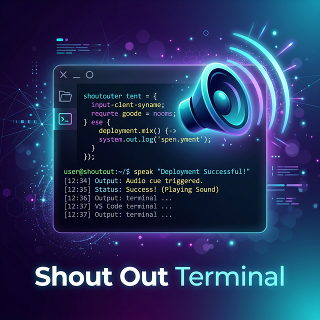

# Shout Out Terminal 🔊

**Your terminal talk back!** Get instant audio feedback for errors, build results, test outcomes, and more — right inside VS Code.

---

### 🔊 Stop straining your eyes. Start using your ears.
*Shout Out Terminal* transforms your coding experience by adding a layer of audio awareness to your development workflow. No more context switching or scrolling back to check if your long-running build finally finished.

[Features](#-features) • [Configuration](#-configuration) • [Supported Tools](#-supported-languages--tools) • [About the Author](#-about-the-author)

---
## ✨ Features

- **⚡ Real-time Feedback (Amature Mode)**: Hear sounds immediately as patterns are detected in your terminal stream.
- **📊 Summary Feedback (Mature Mode)**: Get a single intelligent summary sound once your command process exits.
- **🧠 Smart Context Awareness**: Automatically ignores silent commands like `cd`, `ls`, or `clear`. Only barks when something real happens.
- **🛠️ Zero Configuration**: Works out of the box with 16+ languages and 10+ test frameworks.
- **🎧 High-Quality Audio**: Premium `.wav` samples optimized for clear delivery across Windows, macOS, and Linux.

---

## ⚙️ Configuration

Customize how the terminal talks back in your VS Code settings under `Shout Out Terminal`.

| Setting | Type | Default | Description |
| :--- | :--- | :--- | :--- |
| `shout-out-terminal.mode` | `string` | `"amature"` | `"amature"` (real-time) or `"mature"` (summary) |

> [!TIP]
> **Amature Mode** is best for active debugging and fast iteration.
> **Mature Mode** is perfect for long-running builds and background processes.

---

## 🛠️ Supported Languages & Tools

Shout Out Terminal is built to handle the modern developer's toolkit:

- **Languages**: Node.js, Python, Java, TypeScript, Rust, Go, .NET, C/C++
- **Build Systems**: npm, yarn, Maven, Gradle, webpack, vite, esbuild, cargo, make, cmake
- **Test Runners**: Jest, Mocha, Vitest, pytest, unittest, JUnit, Go test, Cargo test

### 🎵 Event Sounds Matrix

| Event | Audio Cue | Condition |
| :--- | :--- | :--- |
| **Error** | ⚠️ Alert | Runtime exceptions, fatal crashes |
| **Syntax Error** | 🧩 Click | Lints, compilation errors |
| **Build Success** | 🎉 Chime | Successful build/compilation |
| **Test Passed** | ✅ Success | All tests passing |
| **Test Failed** | ❌ Fail | Any test suite failure |
| **System Exit** | 🚪 Door | Process finished / exit code |

---

## 💻 Cross-Platform Support

We ensure compatibility by using native system players for zero-latency playback.

| OS | Backend Player | Requirement |
| :--- | :--- | :--- |
| **Windows** | `cmdmp3` | Built-in |
| **macOS** | `afplay` | Built-in |
| **Linux** | `aplay` | `alsa-utils` (usually pre-installed) |

---

## 👤 About the Author

Built with ❤️ by **Darshan**. 

Passionate about building tools that enhance developer productivity and accessibility.

---

### 📝 Support & Contribution

If you find this extension useful, consider giving it a ⭐ on [GitHub](https://github.com/DarshanAguru/shout-out-terminal). Found a bug? Open an issue!

[Open an Issue](https://github.com/DarshanAguru/shout-out-terminal/issues) • [View Repository](https://github.com/DarshanAguru/shout-out-terminal)

